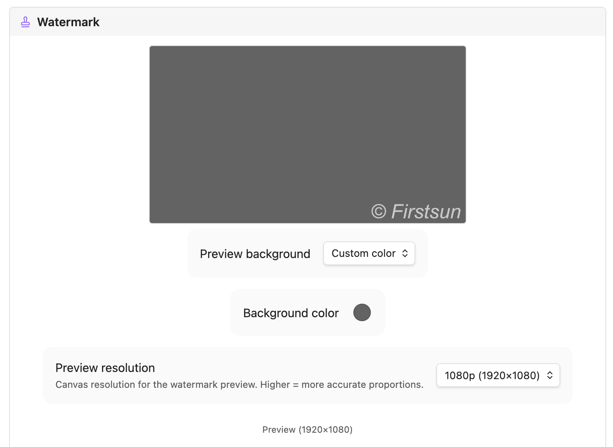

<div align="center">

# Watermark Bucket Uploader
*Paste an image. It's uploaded, watermarked, and linked — before you lift your finger.*

[](https://github.com/firstsun-dev/watermark-bucket-uploader/actions/workflows/ci.yml)
[](https://github.com/firstsun-dev/watermark-bucket-uploader/releases)
[](https://obsidian.md/plugins?id=watermark-bucket-uploader)
[](LICENSE)

**[Releases](https://github.com/firstsun-dev/watermark-bucket-uploader/releases)** · **[繁體中文](README.zh-TW.md)** · **[Changelog](CHANGELOG.md)**

</div>

Stop wrestling with image hosting. This Obsidian plugin intercepts every paste and drop, stamps your watermark, converts to WebP, uploads to your own S3/R2 bucket, and drops a clean `` right into your note. Zero friction. Your images, your infrastructure, your brand.

   

<video src="assets/watermark-bucket-uploader-en.webm" width="100%" controls autoplay loop muted playsinline></video>


*The Live Preview shows your text and logo watermark exactly as it will be applied, before you upload a single image.*

## What's inside

- **Zero-step uploads** — paste or drag an image and it's already in your bucket. No menus, no dialogs.
- **Your watermark, your brand** — overlay custom text or your logo on every image automatically. Font, size, color, opacity, position — all yours to configure, with a live preview so what you see is what you get.
- **Smaller files, faster pages** — automatic WebP conversion and compression keep your storage lean and your site fast.
- **Works with any S3-compatible storage** — Cloudflare R2, AWS S3, MinIO, Backblaze B2, and more. Bring your own bucket.
- **Keeps your private notes private** — glob-based ignore patterns let you exclude specific folders from ever being uploaded.
- **Not just images** — optionally upload video, audio, and PDFs the same way.

## Installation

### From Community Plugins (recommended)
1. Open **Settings → Community plugins** and turn off restricted mode.
2. Click **Browse**, search for **Watermark Bucket Uploader**, click **Install**, then **Enable**.

### Manual
1. Download `main.js`, `manifest.json`, and `styles.css` from the [latest release](https://github.com/firstsun-dev/watermark-bucket-uploader/releases/latest).
2. Create `<vault>/.obsidian/plugins/watermark-bucket-uploader/`.
3. Copy the three files into that folder.
4. Reload Obsidian and enable the plugin under **Settings → Community plugins**.

## Quick start

1. Go to **Settings → Watermark Bucket Uploader** and fill in your bucket credentials (see [Storage](#storage)).
2. Configure a text or logo watermark and check the **Live Preview** (see [Watermark](#watermark)).
3. Paste or drag an image into any note — it uploads, gets watermarked, and a `` link is inserted automatically.

For a step-by-step walkthrough on setting up Cloudflare R2 and configuring watermarks, see the [Cloudflare R2 & Watermarks Setup Guide](docs/how-to-setup-r2-and-watermarks.md).

## Configuration

### Storage

| Field | Description |
|---|---|
| Access Key | S3 / R2 access key ID |
| Secret Key | S3 / R2 secret access key (stored securely in local storage) |
| Region | Bucket region (`auto` for Cloudflare R2) |
| S3 Bucket | Your bucket name |
| Bucket Folder | Optional path prefix — supports `${year}`, `${month}`, `${day}`, `${basename}` |
| Custom Endpoint | Required for R2 and non-AWS providers |
| Custom Image URL | Public URL base, e.g. your CDN or custom domain |

#### Cloudflare R2 quick setup

1. Create a bucket in the R2 dashboard.
2. Generate an API token with **Object Read & Write** permissions.
3. Set **Custom Endpoint** to `https://<account-id>.r2.cloudflarestorage.com`.
4. Set **Region** to `auto`.
5. Set **Custom Image URL** to your public bucket domain.

### Watermark

Open the **Live Preview** in settings to see changes in real time.

| Field | Description |
|---|---|
| **Text Watermark** | Toggle text overlay |
| Text | e.g. `© yourdomain.com` |
| Font / Size / Style / Color | Full typography control; size `0` = auto (2% of image width) |
| **Logo Watermark** | Toggle image overlay |
| Logo Path | Vault-relative path, e.g. `_assets/logo.png` |
| Logo Size / Opacity | Scale (% of image width) and transparency (0–1) |
| Position | Bottom Right, Bottom Left, Bottom Center, or Center |
| Offset X/Y | Fine-tune placement (±% of image dimensions) |
| Preview Res | Canvas resolution for preview accuracy (720p–4K) |

## Daily workflow

| Action | Result |
|---|---|
| `Ctrl/Cmd+V` in any note | Intercepts the image, processes it, uploads, inserts `` |
| Drag & drop onto the editor | Same pipeline (enable "Upload on drag" in settings) |
| Command Palette → `Upload image` | Pick a local file to upload manually |
| Auto-upload on create | Any image added to your vault is uploaded and removed locally |

## Privacy and security

- **Local storage** — bucket credentials are stored locally in the plugin's data folder inside your vault, and are only ever sent to the storage endpoint you configured.
- **No telemetry** — the plugin collects no usage data or analytics.

## Requirements

- Obsidian **1.6.6** or later
- Desktop and mobile supported

## Development

```bash
git clone https://github.com/firstsun-dev/watermark-bucket-uploader.git
npm install

npm run dev    # watch build
npm run build  # type-check + production build
npm run test   # vitest suite
npm run lint   # eslint
```

## License

MIT

---

**Created by [ClaudiaFang](https://github.com/firstsun-dev)**
